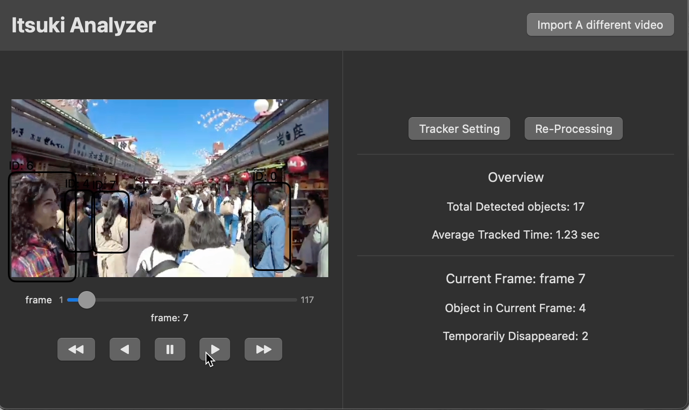

# MacOS Human Traffic Analyzer

This is a MacOS App for analyzing Human traffic using existing videos.  

If you are looking for a real-time Human traffic tracker, please check out [ItsukiHumanTracker_iOS](https://github.com/0Itsuki0/ItsukiHumanTracker_iOS).

## Capabilities
Analyze human traffic using Vision framework with the abilities to:

- Import video
- Set **Max Disappeared Frame Count**: If an object is not detected for a frame count greater this value, will be considered as disappeared.
- Set **Max Normalized Distance**: If the centroid of 2 detected objects in 2 consecutive frames is larger than this value, they will be considered as different objects. Normalized using the size of the frame.
- Process the video using parameters set. 
- Optional: Play around wth the parameters and re-process the same video
- Optional: Import a different video for another analysis

After processing, following will be shown.

- Video displayed with
    - Rectangle bounded box surrounding the detected objects (I meant human being)
    - ID assigned so that you get an idea of which ones are tracked across different frames
    - controls to play, pause, and select frame.
- Information on the entire clip
    - The total number of tracked object
    - Average time in second that an object is tracked.
- Information on the current selected frame
    - objects in the current frame
    - objects that are temporally marked as disappeared.
- Option to change tracker settings: **Max Disappeared Frame Count** and **Max Normalized Distance**, and analyze the same video again using the new parameters.
- Import a different video to make another analysis.

For further detail, please refer to [Swift/MacOS: Human Traffic Analyzer](https://medium.com/@itsuki.enjoy/swift-macos-human-traffic-analyzer-3e2368d49f14
).

## Prerequisite to Run
- [Xcode 16 beta](https://developer.apple.com/download)
- MacOS 15

## Demo

